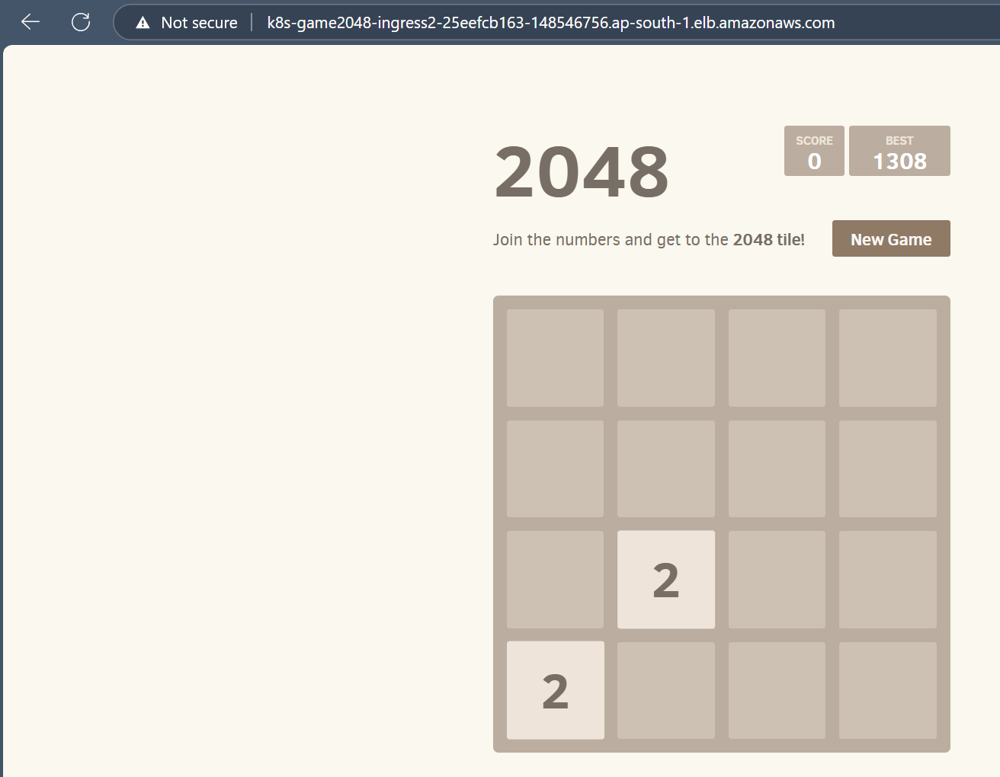

# 2048-Game-On-EKS
## 2048 Tile Game Deployed on AWS EKS 

---
## Pre-requisites: 

1. AWS CLI 
2. kubectl 
3. eksctl 

## Installation: 

1. EKS cluster setup (fargate):  

`eksctl create cluster --name 2048-game-cluster --region ap-south-1 --fargate` 

2. kubectl-EKS connection config:

`aws eks update-kubeconfig --region ap-south-1 --name 2048-game-cluster`

4. create fargate profile (isolate fargate managed resources):

`eksctl create fargateprofile --cluster 2048-game-cluster --region ap-south-1 --name alb-2048-game --namespace game-2048`

5. create namespace, deployment, pod, service, ingress rule: 

`kubectl apply -f https://raw.githubusercontent.com/kubernetes-sigs/aws-load-balancer-controller/v2.5.4/docs/examples/2048/2048_full.yaml`

6. configure IAM-OIDC provider (for ingress controller - ALB communication):

`eksctl utils associate-iam-oidc-provider --cluster 2048-game-cluster --approve`

7. configure and create AWSLoadBalancerControllerIAM policy:

`curl -O https://raw.githubusercontent.com/georgetom-e/2048-Game-On-EKS/refs/heads/main/AWSLoadBalancerControllerIAMPolicy.json`

`aws iam create-policy --policy-name AWSLoadBalancerControllerIAMPolicy --policy-document file://AWSLoadBalancerControllerIAMPolicy.json`

8. install ALB controller (post adding and updating eks repo):

`helm install aws-load-balancer-controller eks/aws-load-balancer-controller -n kube-system --set clusterName=2048-game-cluster --set serviceAccount.create=false --set serviceAccount.name=aws-load-balancer-controller --set region=ap-south-1 --set vpcId= <vpc-id>` 

**verify ingress controller status**: 
`kubectl get deployment -n kube-system aws-load-balancer-controller`

9.  load balancer should be active under EC2: access 2048 game at LB's address (kubectl get ingress -n 2048, address field))
    http://k8s-game2048-ingress2-25eefcb163-148546756.ap-south-1.elb.amazonaws.com

    Ingress Controller (K8 pod) picks up ingress rules from Ingress Resource (static yaml) and provisions a Load Balancer (ELB).
    The address of this load balancer is made available at the ingress resource's address field.

11. **cleanup**: delete the eks cluster: `eksctl delete cluster --name 2048-game-cluster --region ap-south-1`
             delete assosciated resources, such as the elastic load balancer, created roles and policies. 
             `aws elbv2 describe-load-balancers --region <region>`
             `aws ec2 describe-nat-gateways --region <region>`

